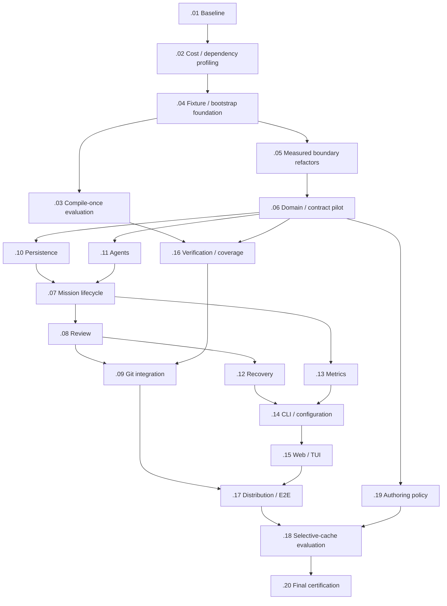

# TASK-2622 mission schedule

Every short ID below is a child of TASK-2622. Arrows mean prerequisite completion through the repository workflow before dependent implementation. This is a conservative fixture/contract migration order, not a claim that product domains cannot evolve independently.

## Suggested scheduling

| Phase | Ready missions | Purpose / constraint |
|---|---|---|
| 1 | .01 | Freeze behavior/coverage/performance baseline. |
| 2 | .02 | Attribute actual runtime cost and refine bounded scopes. |
| 3 | .04 | Settle fixture ownership and bootstrap/assets. |
| 4 | .03 + .05 | Compile evaluation and bounded dependency changes; separate runner files from production seams. |
| 5 | .06 | Pilot migration after boundary decision; .03 may continue if it owns disjoint files. |
| 6 | .10 + .11 + .16 + .19 | Persistence, agents, verification and authoring lanes; .16 additionally needs .03. |
| 7 | .07 | Lifecycle consumes persistence and agent fixtures. |
| 8 | .08 + .13 | Review and metrics can migrate in parallel. |
| 9 | .09 + .12 | Integration and recovery after review; .09 also needs .16. |
| 10 | .14 | .14 waits for recovery and metrics; .09 may continue independently. |
| 11 | .15 | Presentation after stable CLI/read-model contracts. |
| 12 | .17 | Distribution/E2E after integration and presentation. |
| 13 | .18 | Optional cache evaluation after complete migrations and policy. |
| 14 | .20 | Fresh final parity and representative throughput certification. |

Follow arrows rather than treating phases as global barriers: independent lanes may continue while unrelated work is pending. There are no measured duration estimates, so this graph specifies order rather than calendar dates.

Dependency-ready does not prove edit-safe parallelism. Before drafting parallel Missions, partition mixed legacy files at assertion/file level and assign one owner to each shared helper, category/selection registry, partition policy and composition seam. Domains needing the same mutable fixture or production file must coordinate or serialize those changes. In particular, .03 owns runner/compiled-output work, .04 settles common bootstrap/helpers first, .05 owns bounded measured production edges, and .16 consumes the accepted runner outcome. Avoid concurrent rename/registry edits without explicit ownership.

.03, .05 and .18 may finish with an evidence-based reject/no-change disposition; dependents do not require adopting compilation, production refactors or caching. If a solution requires changing ports-and-adapters principles or boundaries, pause dependent implementation for the broader user discussion and explicit subsequent decision. Independent architecture-preserving work can continue.

TASK-2622.20 transitively depends on all nineteen earlier children. It must still run fresh required gates and verify behavior/coverage; graph completion is not proof of correctness.

The task `dependencies` frontmatter is the scheduling authority. This diagram was generated from it. Update the diagram/table together with dependency edits. See [inventory](task-2622-test-wave-inventory.md) for file ownership and scope.
